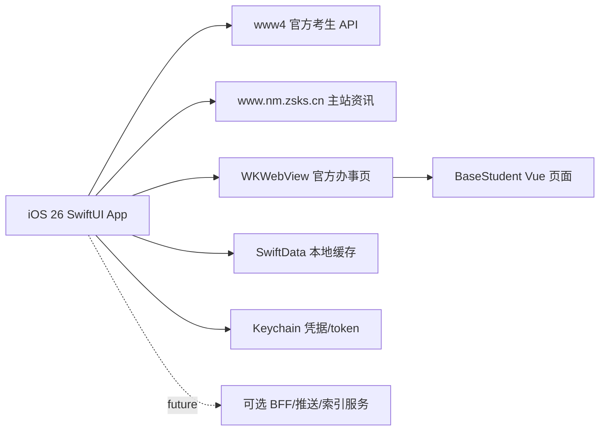

# 内蒙古高考助手 iOS 26 MVP 架构

## 产品边界

首版采用 iOS-only 架构，不强依赖自有后端。原因是官方考生平台的登录和主要办事能力都可由 App 直接对接：

- 原生登录调用 `https://www4.nm.zsks.cn/exam/basic-student/api/student/login`。
- 密码按官方前端一致的 AES-ECB/PKCS7 方式加密。
- 官方验证码是前端本地生成，App 可本地生成并校验。
- 需要填报、缴费、打印等高风险流程时，用受控 `WKWebView` 打开官方页面。
- 官网政策资讯来自 `https://www.nm.zsks.cn/`，App 直接抓取、解析并缓存。

后端保留为以后增强项：推送、全量定时抓取、全文索引、跨设备同步、附件 OCR。

## 系统架构



## 文件结构

```text
apps/ios/
  project.yml                         XcodeGen 工程定义，iOS 26-only
  NeimengGaokao/
    App/                              App 入口、Tab、路由、依赖注入
    Core/API/                         官方 API 与官网资讯抓取
    Core/Design/                      iOS 26 Liquid Glass 封装、服务目录
    Core/Keychain/                    Keychain 读写
    Core/Models/                      SwiftData 模型、JSONValue
    Core/WebBridge/                   WKWebView、官方 session 注入
    Features/Auth/                    考生登录绑定
    Features/Dashboard/               工作台
    Features/Services/                服务入口
    Features/Content/                 资讯列表和详情
    Features/Calendar/                政策日期整理
    Features/Settings/                我的/隐私/缓存
  NeimengGaokaoTests/                 关键单测
.github/workflows/
  ios26ui-unsigned-ipa-build.yml      macos-26 unsigned IPA CI
```

## 本地数据模型

SwiftData 模型：

- `CandidateProfile`：考生档案展示信息，不保存完整身份证号。
- `CachedArticle`：官网文章缓存，含栏目、标题、摘要、正文、附件 JSON、发布时间、收藏状态。
- `CachedCategory`：官网栏目缓存。
- `CachedServiceLink`：本地服务入口缓存扩展位。

Keychain：

- `official.idNumber`
- `official.password`
- `official.token`
- `official.baseUserInfo`

## 官方 API

学生平台 API 基地址：

```text
https://www4.nm.zsks.cn/exam/basic-student/api/
```

已封装：

```text
POST /student/login
GET  /stusercenter/getExamTypeList
GET  /stusercenter/getExamCalendarV2
GET  /stusercenter/serlist
```

`serlist` 返回的服务会被转换为 App 内可打开入口：

- 外部服务：保留官方 URL，并补 `planCode` / `token`。
- iframe 服务：转换为 `/BaseStudent/systemTotal?src=...&planCode=...`，由官方页面继续处理。

官网资讯：

```text
GET https://www.nm.zsks.cn/
GET https://www.nm.zsks.cn/tzgg/
GET https://www.nm.zsks.cn/kszs/ptgk/ggl/
GET https://www.nm.zsks.cn/kszs/ptgk/zcfg/
GET https://www.nm.zsks.cn/zszc1/
GET https://www.nm.zsks.cn/fwpt/
GET https://www.nm.zsks.cn/web/search/375?content=关键词
```

## WebView 会话桥接

官方前端用 `sessionStorage` 保存加密会话：

- `STUTOKEN`
- `BASEUSERINFO`

App 原生登录成功后保存 token 和原始 `baseUserInfo` 到 Keychain。进入 `www4.nm.zsks.cn` 时，`OfficialWebSessionScript` 在 `atDocumentStart` 注入同格式加密值，使官方 Vue 路由守卫和 iframe 服务能复用 App 登录态。

## UI 架构

- 工作台：考生档案、官方状态、常用服务、最新政策。
- 服务：优先显示官方 `serlist` 实时入口，静态入口兜底。
- 资讯：官网栏目、站内搜索、本地缓存、文章详情和附件入口。
- 日历：从公告/政策标题和正文抽取关键日期。
- 我的：Keychain 凭据状态、官方来源、缓存清理。

## 构建

GitHub Actions 使用 `macos-26` 和 Xcode 26：

```text
xcodegen generate
xcodebuild -project NeimengGaokao.xcodeproj \
  -scheme NeimengGaokao \
  -configuration Release \
  -sdk iphoneos \
  -destination "generic/platform=iOS" \
  CODE_SIGNING_ALLOWED=NO \
  build
```

产物是 unsigned IPA，可交给 Sideloadly、AltStore 等工具签名安装。
